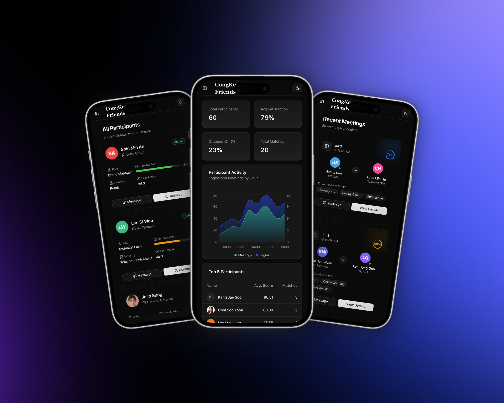
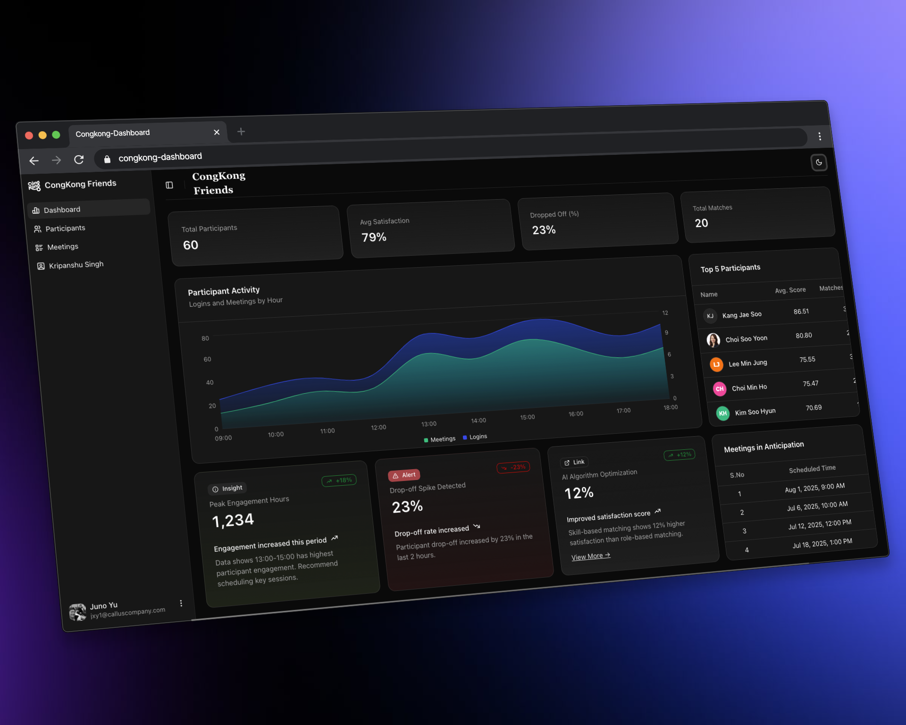

# CongKong Friends - AI Live Matching Platform

<div align="center">
  
  
</div>

---

<div align="center">
  
  
  
  
  
  
  
</div>

## 📝 Assignment Overview

<blockquote>
  <p>A full-stack web application for an AI-powered live matching platform, built with Next.js, Tailwind CSS, and Supabase as part of a competency assessment in Full Stack Web Development.</p>
</blockquote>

## 🚀 Features

### Core Requirements

<details>
<summary><strong>🎯 Click to expand core features</strong></summary>

- **Responsive Dashboard UI** built with Next.js and Tailwind CSS
- **Mobile-first design** with adaptive layouts for all screen sizes
- **Supabase Integration** for backend services
  - PostgreSQL database with optimized schema
  - Real-time data fetching and updates

</details>

### Additional Features Implemented

<table>
<tr>
<td width="50%">

**UI/UX Features**

- Theme Switching (Light/Dark mode)
- Interactive Side Navigation
- Collapsible menus
- Fluid responsive layouts

</td>
<td width="50%">

**Management Features**

- Participants Management Page
- Meetings Management Page

</td>
</tr>
</table>

## 🛠️ Technologies Used

<div align="cnter">
  
### Frontend Stack
| Technology | Version | Purpose |
|------------|---------|---------|
| Next.js | 14 | React Framework with App Router |
| React | 18 | UI Library |
| Tailwind CSS | 3.x | Utility-first CSS framework |
| ShadCN UI | Latest | Component library |
| TypeScript | 5.x | Type safety |

### Backend Stack

| Technology         | Purpose                                  |
| ------------------ | ---------------------------------------- |
| Supabase           | PostgreSQL database & real-time features |
| Supabase JS Client | Database operations                      |

</div>

## 🖥️ System Requirements

<div align="">

| Requirement      | Version          |
| ---------------- | ---------------- |
| Node.js          | 18+              |
| npm              | 9+               |
| yarn             | 1.22+ (optional) |
| Supabase Account | Required         |

</div>

## 🛠️ Installation

<details>
<summary><strong>Step-by-step installation guide</strong></summary>

### 1. Clone the repository

```bash
git clone https://github.com/kripanshu-singh/congkong-dashboard.git
cd congkong-dashboard
```

### 2. Install dependencies

```bash
npm install
# or
yarn install
```

### 3. Set up environment variables

```bash
cp .env.local
```

Fill in your Supabase credentials:

```env
NEXT_PUBLIC_SUPABASE_URL=your_supabase_url_here
NEXT_PUBLIC_SUPABASE_ANON_KEY=your_supabase_anon_key_here
```

### 4. Run the development server

```bash
npm run dev
# or
yarn dev
```

<div align="">
  <strong>🎉 Your application should now be running at <code>http://localhost:3000</code></strong>
</div>

</details>

## 🌐 Deployment

<div align="">
  
  **🚀 Live Demo**
  
  [View Live Application](swdkmdkkldmcflkvmlkemdklmclkmdmxclmdmckdamscmlkdmklmwklecdnkvnkdnsklj)
  
  *Deployed with Vercel
  
</div>

## 🎥 Video Presentation

<div align="">
  
  **📹 Project Walkthrough**
  
  [Watch the Demo Video](#)
  
  *Showcasing features and functionality*
  
</div>

# Performance & Quality Metrics

| Aspect                   | Implementation                                             |
| ------------------------ | ---------------------------------------------------------- |
| **🚀 Performance**       | Lazy loading, optimized images, efficient bundle splitting |
| **🔒 Type Safety**       | Comprehensive TypeScript integration across all components |
| **🎨 Design System**     | Custom theme variables and consistent UI patterns          |
| **📱 Responsive Design** | Fluid layouts from mobile (320px) to desktop (1920px+)     |
| **💾 Data Management**   | Efficient Supabase queries with proper error handling      |

## 📂 Project Structure

```
congkong-friends/
├── 📁 app/
│   ├── 📁 (dashboard)/           # Main dashboard routes
│   ├── 📁 participants/          # Participants management
│   ├── 📁 meetings/              # Meetings management
│   └── 📄 layout.tsx             # Root layout
├── 📁 components/
│   ├── 📁 ui/                    # ShadCN components
│   ├── 📁 dashboard/             # Dashboard specific components
│   └── 📁 sidebar/               # Navigation components
├── 📁 lib/
│   └── 📁 supabase/              # Supabase client configuration
├── 📁 types/                     # TypeScript type definitions
└── 📁 public/                    # Static assets
```

## 📄 License

<div align="center">
  
  **📜 MIT License**
  
  [View License Details](https://choosealicense.com/licenses/mit/)
  
</div>

---

<div align="center">
  
  ## About Me
  
  
  
  **Kripanshu Singh**
  
  Full Stack Developer | React Enthusiast | Java Developer
  
  [](https://www.linkedin.com/in/singh-kripanshu/)
  [](https://kripanshu-singh.github.io/me/)
  [](https://github.com/kripanshu-singh)
  
  <em>"Building innovative solutions with modern web technologies"</em>
  
</div>

---

<div align="center">
  <sub>Built with using Next.js, React, and Supabase</sub>
</div>
